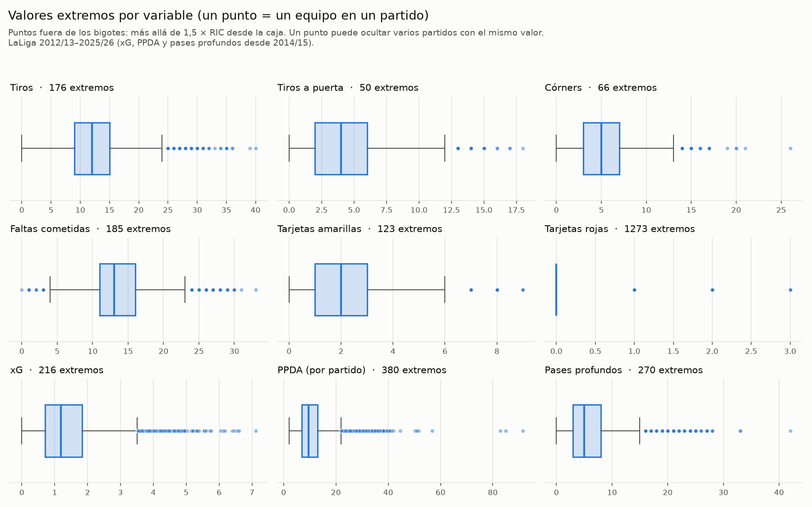
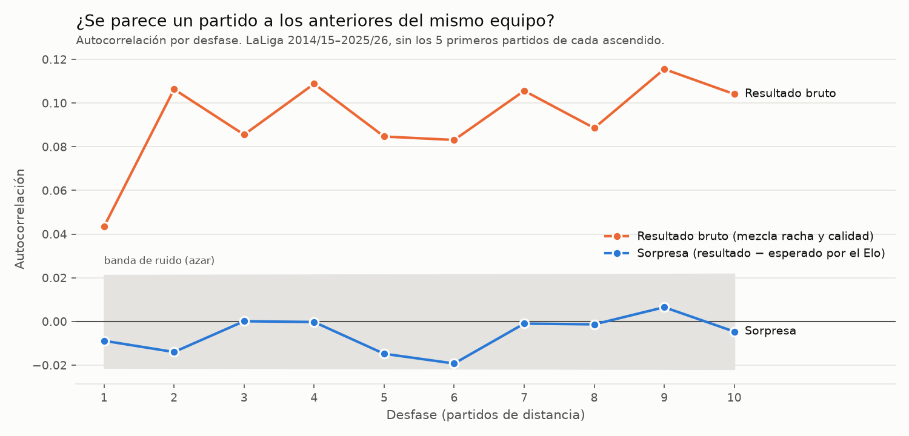
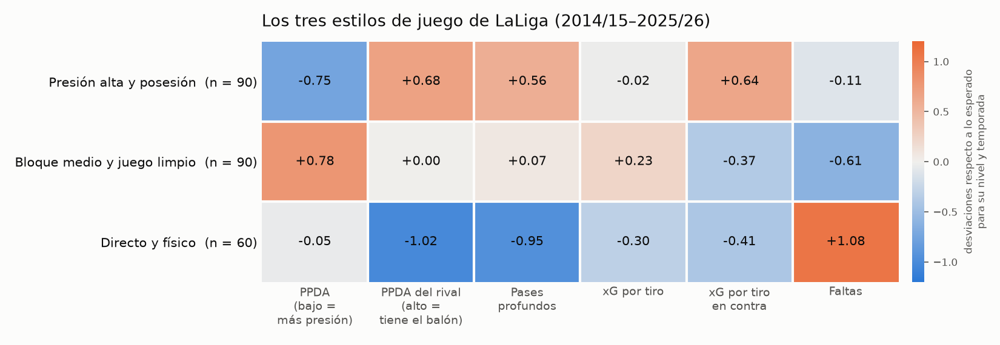
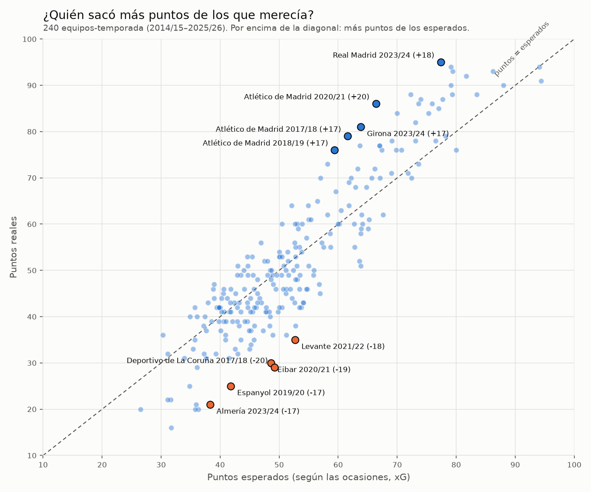

# ⚽ ¿Qué decide un partido de LaLiga?

**Fuerza, forma, estilo o azar.** Proyecto de análisis de datos sobre 12 temporadas de LaLiga (2014/15–2025/26) y la temporada 2026/27 en curso.

> 🚧 En construcción

## Preguntas

| Fase | Pregunta | Técnica |
|---|---|---|
| 1 · Integración y calidad | ¿Cuadran las fuentes? ¿Qué falta? | SQL (DuckDB), reglas de validación |
| 2 · Forma | ¿Cómo evoluciona el rendimiento de cada equipo? ¿Cuánto dura una racha? | Series temporales: Elo propio, xG móvil |
| 3 · Estilo | ¿Qué perfiles de juego hay en LaLiga? | Clustering (equipo-temporada) |
| 4 · Predicción | ¿Aportan algo la forma y el estilo a la fuerza? | Clasificación 1X2 con validación temporal |
| 5 · Azar | ¿Quién tuvo suerte? ¿Cuáles fueron las mayores sorpresas? | Anomalías: puntos vs. puntos esperados |
| 6 · Informe | Conclusiones para un cuerpo técnico | Power BI |

## Datos

| Fuente | Contenido |
|---|---|
| [football-data.co.uk](https://www.football-data.co.uk/spainm.php) | Resultados y estadísticas de partido (las cuotas de apuestas que incluye no se usan) |
| [Understat](https://understat.com/league/La_liga) | xG, PPDA, pases profundos y puntos esperados por partido |

De football-data se descargan además 2012/13 y 2013/14, que solo sirven para «calentar» el Elo: no se analizan ni se usan para entrenar.

Los CSV de football-data están incluidos en `data/raw/football_data/`. Los datos de Understat no se redistribuyen en este repositorio; para obtenerlos:

```bash
python -m venv .venv
.venv\Scripts\activate
pip install -r requirements.txt
python src/download.py
```

El script solo descarga lo que falta, valida cada fichero (380 partidos por temporada) y registra la URL y la fecha de cada descarga en `data/raw/descargas.csv`.

Después, al ejecutar [`notebooks/01_integracion_calidad.ipynb`](notebooks/01_integracion_calidad.ipynb) se generan las tablas limpias en `data/processed/`. El significado de cada columna, su fuente y si se conoce antes o después del partido está en [`diccionario_datos.csv`](data/processed/diccionario_datos.csv).

## Fase 1 · Integración y calidad

- **5.320 partidos** (2012/13–2025/26; las dos primeras temporadas solo sirven para calentar el Elo), 4.560 con datos de Understat.
- Las dos fuentes **coinciden en los goles de todos los partidos**. Se cruzan por `temporada + local + visitante`: cruzar por fecha habría perdido 70 partidos, casi todos nocturnos (Understat usa otra zona horaria).
- **Ningún imposible lógico** en las estadísticas. Los valores extremos (rango intercuartílico) se conservan y están documentados: son partidos reales, no errores.

<p align="center"></p>

## Fase 2 · Forma y fuerza

[`notebooks/02_forma_y_fuerza.ipynb`](notebooks/02_forma_y_fuerza.ipynb)

- **Elo propio** (K = 20, ventaja de local = 65, multiplicador por margen de goles), con pruebas explícitas de que el Elo y la forma de cada partido solo usan información anterior a él.
- **La ventaja de local existe siempre**, con su mínimo en 2020/21, la temporada sin público (aunque no desaparece).
- **Los ascendidos rinden mejor que los descendidos a los que sustituyen** (1,05 frente a 0,82 puntos por partido).
- **Las rachas no existen más allá de la calidad del equipo:** descontada con el Elo, la autocorrelación de los resultados queda dentro del ruido.
- **Para medir el momento de un equipo, el xG reciente es mejor que los puntos recientes**, aunque la fuerza a largo plazo (Elo) anticipa el futuro mejor que ambos.

<p align="center">
  
  
</p>

## Fase 3 · Estilo de juego

[`notebooks/03_estilo.ipynb`](notebooks/03_estilo.ipynb)

- **Estilo ≠ calidad:** casi todas las métricas de estilo están muy ligadas a lo bueno que es un equipo (hasta 0,87). Se estandarizan por temporada (la liga presiona menos que hace 10 años) y se descuenta la parte que explica el Elo.
- **Los estilos de LaLiga son un continuo:** con k-means, la silueta apenas supera la de datos sin estructura y ningún número de grupos es estable. Aun así, **tres perfiles** lo resumen bien: *presión alta y posesión* (Barcelona, Celta, Betis), *bloque medio y juego limpio* (Real Madrid, Villarreal) y *directo y físico* (Getafe, Atlético de Simeone, Athletic).
- **Se ve la evolución de los equipos:** el Atlético pasa de *directo y físico* (2014–2022) a *bloque medio* y, en 2025/26, a *presión alta*.

<p align="center">
  
  
</p>

## Fase 4 · ¿Qué decide un partido?

[`notebooks/04_modelo.ipynb`](notebooks/04_modelo.ipynb)

Regresión logística **ordinal** (respeta el orden victoria local > empate > victoria visitante) evaluada con el **RPS**, la métrica estándar en predicción de fútbol.

- **Validación progresiva:** cada temporada de 2019/20 a 2023/24 se predice solo con las anteriores. Todas las variables se calculan con información previa al partido, y el estilo se ajusta dentro de cada pliegue.
- **Test prerregistrado:** 2024/25 y 2025/26 no se usaron para ninguna decisión. El modelo y la comparación a evaluar se fijaron y se guardaron en Git [antes de mirar el test](notebooks/04_modelo.ipynb).

| En test (705 partidos) | RPS | Acierto |
|---|---|---|
| Frecuencias históricas / siempre gana el local | 0,2259 | 47,1 % |
| **Solo fuerza (Elo)** | **0,1986** | 52,6 % |
| Fuerza + forma (modelo prerregistrado) | 0,1987 | 53,6 % |
| Fuerza + forma + estilo | 0,1973 | 54,9 % |

**Resultados:**
- **La fuerza es casi todo lo predecible.** Ni la forma ni el estilo añaden información fiable sobre el Elo: sus mejoras no superan el ruido (IC 95 % por bootstrap emparejado).
- **Los puntos «de más» son suerte:** con el Elo y el xG reciente en el modelo, la forma en puntos tiene efecto *negativo*.
- **El azar domina el partido individual:** incluso conociendo el xG del propio partido, el ~75 % de la incertidumbre sigue sin explicar.

<p align="center">
  
  
</p>

## Fase 5 · El azar

[`notebooks/05_azar.ipynb`](notebooks/05_azar.ipynb)

- **La suerte puede valer ±20 puntos en una temporada** (puntos reales − puntos esperados según el xG). Récords: Atlético 2020/21 (+19,6) y Deportivo 2017/18 (−20,2).
- **Casi toda es azar:** apenas se repite entre la primera y la segunda vuelta (0,16), mientras que el rendimiento sí (0,62–0,82). **Y se devuelve:** por cada punto de suerte, 0,73 puntos menos la temporada siguiente.
- **Lo único persistente es de los grandes:** tras corregir por comparaciones múltiples (Benjamini-Hochberg), solo Real Madrid, Atlético y Barcelona superan sus puntos esperados de forma sistemática. Los puntos esperados infravaloran a la élite. Historias atractivas, como que el Atlético encaje menos gracias a su portero, no superan la corrección.
- **Las mayores sorpresas** son derrotas en casa de los grandes. La mayoría, con suerte (el ganador creó menos xG), y ocurren con la frecuencia que el modelo predice.
- **Partidos anómalos** (*Isolation Forest*): goleadas con asedio y expulsiones, sin indicios de errores de datos.

<p align="center">
  
  
</p>

## Estructura

```
data/raw/         Descargas originales, nunca se editan (Understat no versionado)
data/processed/   Tablas limpias e integradas
notebooks/        Análisis paso a paso
src/              Scripts reutilizables (descarga, limpieza, Elo…)
powerbi/          Informe final
reports/figures/  Gráficos
```
