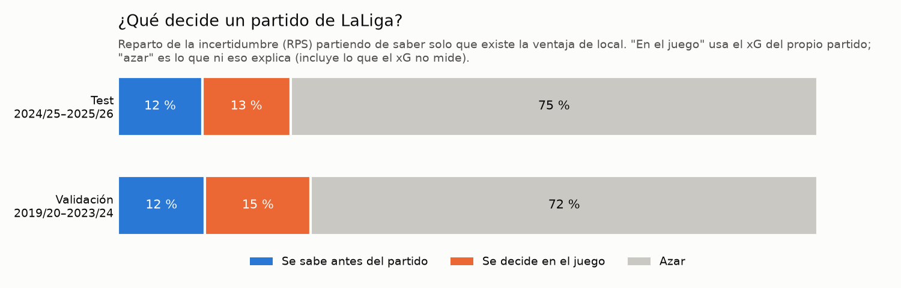
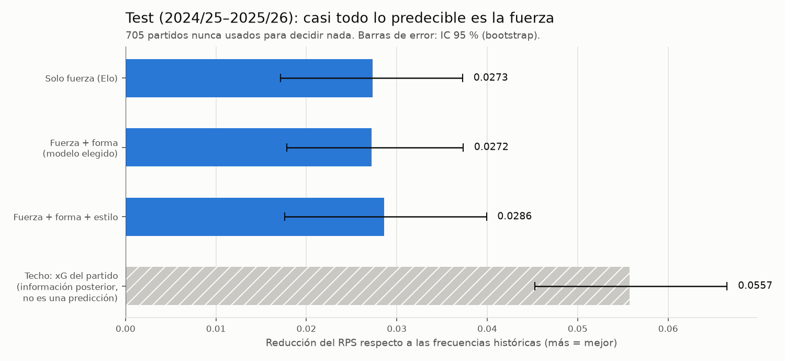
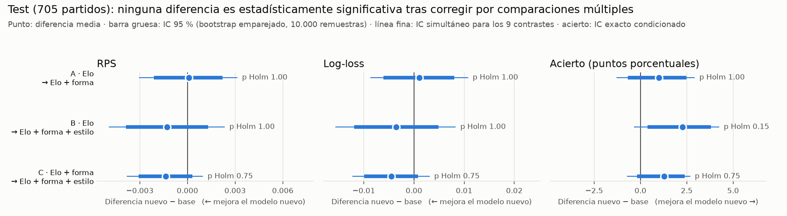
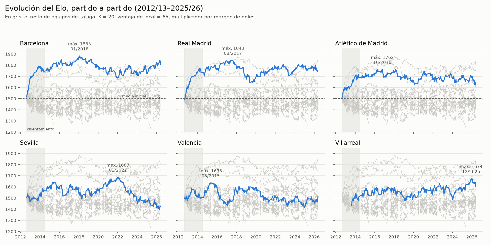
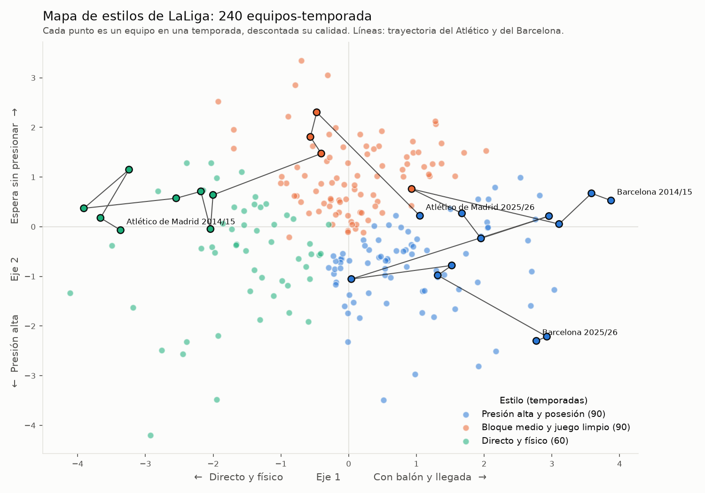
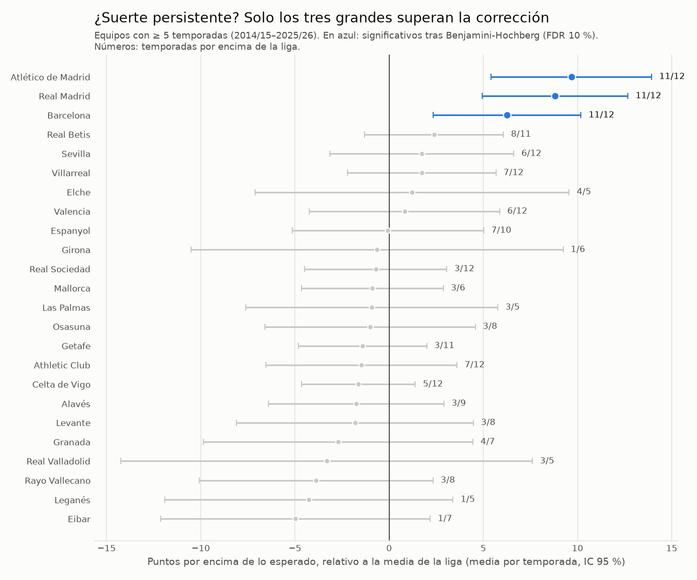

# ⚽ ¿Qué decide un partido de LaLiga?

**Fuerza, forma, estilo o azar.** Análisis de 12 temporadas de LaLiga (2014/15–2025/26, 4.560 partidos) con datos públicos de resultados, estadísticas y xG.

## Objetivo

Averiguar **qué factores explican los resultados de LaLiga y cuánto aporta cada uno**: la fuerza acumulada de un equipo, su forma reciente, su estilo de juego o el azar. No se trata de construir el modelo que más acierta, sino de **medir con rigor qué información sirve de verdad** y cuánto queda fuera del alcance de cualquier predicción.

| Pregunta | Tipo de análisis | Cómo se responde |
|---|---|---|
| ¿Cómo evoluciona la fuerza de cada equipo? ¿Existen las rachas? | Descriptivo | Elo propio y forma reciente calculados partido a partido solo con información previa; autocorrelación |
| ¿Hay estilos de juego distintos? | Descriptivo | Métricas de estilo corregidas por calidad, *clustering* y comparación con datos sin grupos |
| ¿Aportan la forma y el estilo algo a la fuerza para anticipar un partido (1X2)? | **Predictivo** | Modelo de probabilidades con validación temporal y un test de dos temporadas apartado hasta el final |
| ¿Cuánto es azar? ¿Quién tuvo suerte y qué partidos fueron anómalos? | Descriptivo e inferencial | Puntos frente a puntos esperados, persistencia, comparaciones múltiples, *Isolation Forest* |

**Qué aprendemos sobre LaLiga:** la fuerza acumulada resume casi todo lo que se puede saber antes de un partido; la forma y el estilo no añaden información fiable; los estilos forman un continuo más que grupos; y en un partido concreto la mayor parte del resultado no es predecible con estos datos.

**Qué demuestra el proyecto (Data Science):** integración y validación de fuentes reales con SQL, *feature engineering* temporal sin fuga de información (probada con tests), validación temporal en lugar de aleatoria, métricas adecuadas para probabilidades (RPS, calibración), incertidumbre cuantificada (*bootstrap*, corrección por comparaciones múltiples), un pipeline reproducible y determinista, y comunicación honesta de resultados negativos y limitaciones.

## En 30 segundos

- **La fuerza acumulada (Elo) es casi todo lo predecible.** En el test (705 partidos nunca usados para elegir el modelo) reduce el RPS de 0,226 a 0,199 respecto a las frecuencias históricas.
- **Ni la forma reciente ni el estilo de juego añaden información fiable sobre el Elo.** La mejora de la forma en test es −0,0001 (IC 95 %: −0,0022 a +0,0021): se descartan mejoras mayores de ~0,002.
- **La mayor parte de un partido concreto no es predecible con esta información.** Incluso conociendo el xG del propio partido, queda sin explicar ~75 % de la incertidumbre inicial.
- **La "suerte" (puntos − puntos esperados) llega a ±20 puntos por temporada, apenas se repite y se devuelve al año siguiente;** solo los tres grandes la superan de forma persistente tras corregir por comparaciones múltiples.
- **Los estilos de juego forman un continuo, no grupos:** el clustering no se distingue de datos simulados sin grupos. Se usan 3 perfiles solo para comunicar.

Resultados negativos incluidos: la pregunta era qué aporta cada factor, y la respuesta honesta es que casi todo lo predecible ya está en la fuerza.

## Preguntas y técnicas

| Fase | Pregunta | Técnica | Notebook |
|---|---|---|---|
| 1 · Integración y calidad | ¿Cuadran las fuentes? ¿Qué falta? | SQL (DuckDB), reglas de validación | [01](notebooks/01_integracion_calidad.ipynb) |
| 2 · Fuerza y forma | ¿Cómo evoluciona cada equipo? ¿Existen las rachas? | Elo propio, ventanas móviles, autocorrelación, *bootstrap* por equipo-temporada | [02](notebooks/02_forma_y_fuerza.ipynb) |
| 3 · Estilo | ¿Qué perfiles de juego hay? | k-means (equipo-temporada), silueta, estabilidad, PCA | [03](notebooks/03_estilo.ipynb) |
| 4 · Predicción | ¿Aportan la forma y el estilo algo a la fuerza? | Regresión logística ordinal, *walk-forward*, RPS, test apartado | [04](notebooks/04_modelo.ipynb) |
| 5 · Azar | ¿Quién tuvo suerte? ¿Es suerte o habilidad? | Persistencia, regresión a la media, Benjamini-Hochberg, *Isolation Forest* | [05](notebooks/05_azar.ipynb) |
| 6 · Informe | Conclusiones para un cuerpo técnico | Power BI (en preparación; las tablas ya se exportan) | — |

## Datos

| Fuente | Contenido | En el repositorio |
|---|---|---|
| [football-data.co.uk](https://www.football-data.co.uk/spainm.php) | Resultados y estadísticas de partido (tiros, córners, faltas, tarjetas). Sus cuotas de apuestas **no se usan** | Sí (`data/raw/football_data/`) |
| [Understat](https://understat.com/league/La_liga) | xG, xG sin penaltis, PPDA, pases profundos y puntos esperados por partido | **No**: sus condiciones de redistribución no están claras; se descargan con `src/download.py` |

- 2012/13 y 2013/14 (solo football-data) sirven únicamente para **calentar el Elo**: no se analizan ni se usan para entrenar.
- Las fuentes se cruzan por `temporada + local + visitante` y **coinciden en los goles de los 4.560 partidos**. Cruzar por fecha habría perdido 70 partidos, casi todos nocturnos (Understat usa otra zona horaria).
- Cada columna exportada está documentada en [`diccionario_datos.csv`](data/processed/diccionario_datos.csv), incluido **si se conoce antes o después del partido**.

## Pipeline

```
data/raw (football-data + Understat, nunca se editan)
 └─ 01 · integración y calidad ──► partidos, partidos_equipo           (SQL, validaciones que detienen el notebook)
     └─ 02 · Elo y forma ──────────► forma_elo                          (solo información previa a cada partido)
         └─ 03 · estilo ───────────► estilos_equipo_temporada, catálogo (descriptivo)
             └─ 04 · modelo 1X2 ───► predicciones fuera de muestra, métricas, comparaciones
                 └─ 05 · azar ─────► suerte, sorpresas, partidos anómalos
                     └─ 6 · Power BI (en preparación)
```

Las funciones críticas (Elo, métricas, modelo ordinal, coordenadas de estilo, pliegues temporales, comparación estadística de modelos) están en [`src/laliga/`](src/laliga) y se prueban en [`tests/`](tests). Los notebooks las importan y explican el método: por ejemplo, el Elo (fórmulas, K, H, ascendidos, un partido paso a paso) está explicado en la [sección 2 del notebook 02](notebooks/02_forma_y_fuerza.ipynb).

## Resultados del modelo 1X2 (test)

Regresión logística **ordinal** (respeta el orden victoria local > empate > victoria visitante), evaluada con el **RPS** (*Ranked Probability Score*: error de las probabilidades acumuladas; menor es mejor; es la métrica estándar para 1X2 porque, a diferencia del acierto, evalúa las tres probabilidades y respeta el orden de los resultados).

| Test: 2024/25–2025/26 (705 partidos) | RPS | Log-loss | Acierto |
|---|---|---|---|
| Frecuencias históricas (acierto = "siempre gana el local") | 0,2259 | 1,0573 | 47,1 % |
| **Solo fuerza (Elo)** | **0,1986** | 0,9741 | 52,6 % |
| Fuerza + forma (modelo elegido en validación) | 0,1987 | 0,9751 | 53,6 % |
| Fuerza + forma + estilo (informativo) | 0,1973 | 0,9706 | 54,9 % |
| *Techo: con el xG del propio partido (no es una predicción)* | *0,1702* | *0,8815* | *59,7 %* |

- **Qué es el test:** los 705 partidos de 2024/25 (352) y 2025/26 (353), del 15/08/2024 al 24/05/2026. Son los 760 partidos de esas temporadas menos 55 con un ascendido en sus primeros partidos (sin 10 partidos previos para la ventana de estilo), excluidos igual en todos los modelos. Es una muestra de dos temporadas concretas: sirve para comprobar lo decidido en validación, no como medida universal del rendimiento.
- Las diferencias entre los tres modelos con Elo son **compatibles con la variabilidad muestral**: ninguna aporta evidencia estadística suficiente tras corregir por comparaciones múltiples (ver la tabla siguiente; el modelo con estilo, además, era peor en validación).
- **Ningún modelo predice nunca un empate** como resultado más probable (su probabilidad no pasa del ~31 %), así que el ~25 % de empates cuenta siempre como fallo: el acierto sirve para comunicar, no para comparar modelos.
- **Calibración:** fuera de muestra, las probabilidades coinciden con las frecuencias reales (p. ej., lo que el modelo daba con menos de un 10 % ocurrió el 7,5 % de las veces, frente a un 7,2 % predicho).
- Con Elo y xG reciente en el modelo, la forma en **puntos** tiene coeficiente **negativo**: indicio de que los puntos "de más" respecto al juego son suerte que no se mantiene (asociación condicional, no una mejora predictiva).

<p align="center">
  
  
</p>

### ¿Hay evidencia estadística de que un modelo mejore a otro?

Análisis añadido **después** de evaluar el test ([sección 18 del notebook 04](notebooks/04_modelo.ipynb), código en [`src/laliga/comparacion.py`](src/laliga/comparacion.py)). No cambia ningún modelo ni decisión, y no se usa para elegir modelo. Diferencia = **modelo nuevo − modelo base**, partido a partido: en RPS y *log-loss*, **negativa = mejora**; en acierto, positiva = mejora.

| Comparación (705 partidos) | Métrica | Diferencia | IC 95 % | p | p Holm | ¿Evidencia de diferencia? |
|---|---|---:|---:|---:|---:|---|
| Elo → Elo + forma | RPS | +0,0001 | [−0,0021; +0,0022] | 0,945 | 1,00 | No |
| Elo → Elo + forma | Log-loss | +0,0010 | [−0,0061; +0,0080] | 0,775 | 1,00 | No |
| Elo → Elo + forma | Acierto | +1,0 pp | [−0,7; +2,5] pp | 0,281 | 1,00 | No |
| Elo → Elo + forma + estilo | RPS | −0,0013 | [−0,0039; +0,0013] | 0,333 | 1,00 | No |
| Elo → Elo + forma + estilo | Log-loss | −0,0035 | [−0,0119; +0,0049] | 0,414 | 1,00 | No |
| Elo → Elo + forma + estilo | Acierto | +2,3 pp | [+0,4; +3,8] pp | 0,017 | 0,15 | No (solo sin corregir) |
| Elo + forma → Elo + forma + estilo | RPS | −0,0014 | [−0,0031; +0,0003] | 0,113 | 0,75 | No |
| Elo + forma → Elo + forma + estilo | Log-loss | −0,0045 | [−0,0099; +0,0008] | 0,101 | 0,75 | No |
| Elo + forma → Elo + forma + estilo | Acierto | +1,3 pp | [−0,2; +2,4] pp | 0,093 | 0,75 | No |

- **Emparejado:** los tres modelos predicen los mismos 705 partidos (comprobado con tests). Casi toda la variabilidad del RPS se debe a lo difícil que es cada partido, y es común a los tres, así que se comparan las pérdidas **partido a partido** y no las medias como muestras independientes.
- **RPS y *log-loss*:** IC 95 % por ***bootstrap* emparejado** (se remuestrean partidos y la misma remuestra se aplica a los dos modelos; percentil; 10.000 remuestras; semilla 42) y ***t* pareada sobre las diferencias de pérdida**, que contrasta si la pérdida media es la misma. Para predicciones a horizonte 1 es algebraicamente idéntica al contraste de Diebold-Mariano con la corrección de Harvey-Leybourne-Newbold (comprobado en los tests). Se descartó Wilcoxon porque contrasta la mediana de las diferencias y lo que importa es la pérdida **media**.
- **Acierto:** **McNemar exacto** (solo informan los 23–40 partidos en que acierta uno de los dos modelos) con un IC exacto condicionado a esos partidos, coherente con él.
- **Multiplicidad:** **Holm** sobre la familia de 9 contrastes (3 comparaciones × 3 métricas; controla la probabilidad de al menos un falso positivo con cualquier dependencia entre ellos). Por eso el acierto de la segunda comparación no cuenta como evidencia: su p = 0,017 sin ajustar pasa a 0,15 con Holm, y su IC simultáneo (Bonferroni) incluye el 0, aunque el IC 95 % individual, que no está ajustado, no lo incluya. Es el tipo de resultado aislado que puede aparecer por azar al hacer varias comparaciones.
- **Conclusión:** "evidencia estadística" = p ajustado < 0,05 bajo este procedimiento, y **ninguna comparación la alcanza**. Las diferencias observadas son compatibles con la variabilidad muestral: aunque el modelo con estilo tiene mejores valores puntuales en las tres métricas, no se puede afirmar una mejora estadísticamente demostrada. Esto **no demuestra que los modelos sean iguales** ni que la forma o el estilo carezcan de información predictiva: los IC dejan fuera mejoras de RPS de la forma mayores de ~0,002 (≈ 1 %), pero son compatibles con mejoras del estilo de hasta ~0,003–0,004 o con pequeños empeoramientos.
- **Tamaño:** en RPS y *log-loss*, el cambio relativo respecto al modelo base es como mucho del 0,7 % (diferencia / valor del modelo base). Como escala, esas diferencias equivalen como mucho al 5,4 % de la mejora del Elo sobre las frecuencias históricas (diferencia / (Elo − frecuencias)).
- **Dependencia entre partidos:** el *bootstrap* supone partidos independientes. Una sensibilidad parcial, con *bootstrap* por semana natural y por equipo local-temporada, no cambia qué intervalos incluyen el 0, y la autocorrelación de las diferencias es pequeña (máximo 0,09). Son diagnósticos, no una prueba de independencia.
- **Qué no dice:** no demuestra causalidad, no incluye la incertidumbre del entrenamiento (compara estos modelos ya ajustados) y no corrige ninguna de las limitaciones de abajo, en especial el posible sesgo *post hoc* de las fases 2–3.

<p align="center">
  
</p>

## Hallazgos por fase

**Integración y calidad** — Ningún imposible lógico en las estadísticas; los valores extremos (rango intercuartílico) se conservan y documentan: son partidos reales, no errores. Trampas evitadas: fechas leídas como el año 14 d. C., pérdida no aleatoria de partidos nocturnos al cruzar por fecha, la regla falsa "goles ≤ tiros a puerta" (goles en propia puerta), promedios de ratios de PPDA.

**Fuerza y forma** — La ventaja de local existe en todas las temporadas, con su mínimo en 2020/21 (sin público), aunque no desaparece. Los ascendidos rinden mejor que los descendidos a los que sustituyen (1,05 frente a 0,82 puntos por partido). **No hay evidencia de rachas más allá de la calidad del equipo:** descontado el Elo, la autocorrelación de los resultados queda dentro del ruido (si existen, son demasiado débiles para detectarlas). Para anticipar los puntos de los 5 partidos siguientes, el xG reciente (r = 0,43) supera a los puntos recientes (0,36), y el Elo (0,57) a ambos.

**Estilo** — Casi todas las métricas de estilo están muy ligadas a la calidad (hasta r = 0,87), así que se estandarizan por temporada y se descuenta la parte que explica el Elo. **Los estilos son un continuo:** la silueta de k-means (≈ 0,17) supera a datos con columnas barajadas, pero no se distingue de datos simulados sin grupos con las mismas correlaciones, y ningún k es estable (ARI máximo 0,61 < 0,75). Tres perfiles sirven para comunicar: *presión alta y posesión* (Barcelona, Celta, Betis), *bloque medio y juego limpio* (Real Madrid, Villarreal) y *directo y físico* (Getafe, Atlético de Simeone, Athletic).

**Azar** — La suerte puede valer ±20 puntos en una temporada (Atlético 2020/21 +19,6; Deportivo 2017/18 −20,2). La mayor parte es azar: apenas se repite entre la primera y la segunda vuelta (r = 0,16, frente a 0,62–0,82 del rendimiento), y por cada punto de suerte el equipo suma 0,73 puntos menos al año siguiente (control con puntos esperados: +0,02; con sesgo de supervivencia, porque los desafortunados descienden más). De 72 pruebas por equipo, **solo 4 superan la corrección de Benjamini-Hochberg (FDR 10 %), todas de los tres grandes**: sugiere que los puntos esperados infravaloran a la élite. Historias atractivas, como que el Atlético encaje menos gracias a su portero, no superan la corrección. *Isolation Forest* marca como anómalas goleadas con asedio y partidos con varias expulsiones, sin indicios de errores de datos.

<p align="center">
  
  
  
</p>

## Salvaguardas metodológicas

- **Solo información previa al partido.** El Elo guarda su valor *antes* de actualizarse con cada resultado; la forma y el estilo usan ventanas `ROWS … PRECEDING` que excluyen el propio partido. Se comprueba con **pruebas de perturbación** (cambiar un resultado, o todos los posteriores a una fecha, no altera ninguna variable previa), con **dos implementaciones independientes** (SQL y pandas) y con tests que fallan si se introduce una fuga a propósito.
- **Validación temporal, no aleatoria.** Un `train_test_split` aleatorio entrenaría con partidos futuros para predecir el pasado. Se usa validación progresiva (*walk-forward*): cada temporada de 2019/20 a 2023/24 se predice solo con las anteriores.
- **Todo lo que se ajusta, se ajusta con el entrenamiento.** Escalado, regresión que descuenta la calidad del estilo, regularización (elegida con la última temporada del entrenamiento) y frecuencias de referencia; el estilo se estandariza con la temporada anterior, ya conocida.
- **Parámetros del Elo fijados a priori** (K = 20, ventaja de local H = 65, margen de goles de eloratings.net) y nunca reajustados tras ver los datos. H = 65 es una decisión del proyecto, no un valor "correcto" demostrado; su papel y sus efectos se explican en la [sección 2 del notebook 02](notebooks/02_forma_y_fuerza.ipynb).
- **Test apartado.** 2024/25–2025/26 no se usaron para elegir modelo, variables ni regularización: se separan con un `assert` y solo se evalúan al final. El modelo y la única comparación decisiva están escritos en la [sección 12 del notebook 04](notebooks/04_modelo.ipynb), y la elección se reproduce ejecutando solo la validación. No es un prerregistro formal (ver limitaciones).
- **Comparaciones con incertidumbre.** Diferencias de RPS partido a partido con IC 95 % por *bootstrap* emparejado y consistencia entre pliegues; en test, *t* pareada de las diferencias de pérdida, McNemar exacto y corrección de Holm; *bootstrap* por equipo-temporada cuando las observaciones se solapan; Benjamini-Hochberg para las 72 pruebas de suerte persistente.
- **Mismas exclusiones para todos los modelos**, decididas con información previa al partido: ascendidos en sus 5 primeros partidos, partidos sin 5 partidos previos de forma en xG (inicio de 2014/15) y equipos con menos de 10 partidos en la ventana de estilo (en la práctica, los ascendidos en sus ~10 primeros partidos); sin imputar valores.

## Limitaciones

- **Sin cuotas de apuestas** (decisión de alcance): el proyecto mide qué aporta la información futbolística; el listón son modelos de referencia ingenuos y el propio Elo.
- **Pocas variables y sin datos de jugadores:** no hay alineaciones, lesiones, fichajes ni posesión (el estilo se aproxima con el PPDA del rival). El Elo no tiene regresión a la media en verano y tarda en reflejar cambios de plantilla.
- **El xG y los puntos esperados son modelos de Understat** (tirador y portero "medios"): lo que llamamos azar incluye también lo que el xG no mide, y el reparto antes del partido / juego / azar es orientativo, no una descomposición exacta.
- **xG recalculado a posteriori:** el xG histórico lo genera el modelo actual de Understat, que puede haberse ajustado con temporadas posteriores. La forma en xG usa solo partidos anteriores, pero en un uso real se dispondría del xG calculado en su momento. Efecto previsiblemente pequeño, no cuantificable con estos datos.
- **Elo con supuestos simples:** la regla de ascendidos (heredan el Elo medio de los descendidos) los infravalora, documentado y no reajustado para no ajustar a los datos; H = 65 es una decisión del proyecto sin fuente externa y fija en el tiempo, aunque la ventaja de local real varía (mínima en 2020/21); el multiplicador de margen no corrige la inflación de los favoritos.
- **Test de 705 partidos y dos temporadas:** basta para confirmar la mejora grande del Elo (0,027 de RPS), pero no para detectar mejoras menores de ~0,002; ninguna diferencia entre los modelos con Elo (RPS, *log-loss* ni acierto) supera la corrección por comparaciones múltiples. Describe esas dos temporadas y excluye los primeros partidos de los ascendidos. No se amplió a posteriori: cambiar el corte después de ver resultados sería otra forma de ajustar a los datos.
- **El test no es completamente virgen:** sus temporadas aparecen en los análisis descriptivos de las fases 2 y 3, que inspiraron qué bloques probar. Esa contaminación favorecería encontrar mejoras de la forma o del estilo; no se encontró ninguna.
- **Early stopping del *gradient boosting*:** usa un 20 % aleatorio (no temporal) del entrenamiento para decidir cuándo parar. No toca datos de validación ni de test y solo afecta a esa comprobación no lineal, no al modelo elegido.
- **No hubo un prerregistro formal.** El historial de Git se consolidó en un único commit al publicar el repositorio y el plan del test no se depositó en ningún registro externo con fecha. **Lo que sí se puede comprobar en el código:** los parámetros del Elo (K, H), las ventanas y las exclusiones son constantes sin ninguna búsqueda de valores; la regularización se elige dentro del entrenamiento; el test se aparta con un `assert`; y el modelo elegido se reproduce usando solo la validación. **Lo que no se puede demostrar:** el orden temporal, es decir, que esas decisiones y el plan de la sección 12 se escribieran antes de ver los resultados del test.
- **Todo es asociación, no causalidad:** p. ej., que la ventaja de local sea mínima en 2020/21 es compatible con el efecto del público, pero una temporada no permite atribuirlo.
- Una sola liga y un periodo concreto: no se ha comprobado que los resultados se generalicen a otras competiciones.

## Reproducir el proyecto

Requisitos: **Python 3.14** (probado con 3.14.7) y conexión a internet para descargar Understat.

```bash
python -m venv .venv
.venv\Scripts\activate          # Windows · en Linux/macOS: source .venv/bin/activate
pip install -r requirements.txt
python src/pipeline.py          # descarga lo que falte, ejecuta los notebooks 01-05 en orden y lanza los tests (~2 min)
```

- `src/pipeline.py --desde 04` reejecuta solo desde un notebook; `--sin-descarga` y `--sin-tests` omiten esos pasos.
- También se pueden abrir los notebooks (Jupyter o VS Code) y ejecutarlos **en orden**: cada uno lee lo que exporta el anterior en `data/processed/`.
- El pipeline es determinista: dos ejecuciones producen exactamente las mismas tablas y figuras.
- Las tablas procesadas que contienen datos de Understat no se versionan (ver `.gitignore`); se regeneran con el pipeline. Si Understat cambiara su web, `src/download.py` fallaría con un mensaje claro: valida cada fichero (380 partidos por temporada) y registra URL y fecha de cada descarga en `data/raw/descargas.csv`.
- **Power BI** (fase 6) se construirá sobre las tablas de `data/processed/` (importar con configuración regional en-US: fechas ISO y punto decimal). El `.pbix` no se versionará porque incrusta datos de Understat.

## Tests

```bash
pytest
```

109 tests en [`tests/`](tests): fórmulas y reglas del Elo, **invarianza al futuro** del Elo y de la forma, recálculo independiente de la forma publicada, transformaciones ajustadas solo con el entrenamiento, pliegues temporales, RPS y log-loss, modelo ordinal frente a statsmodels, comparación estadística de modelos (alineación de partidos, *bootstrap* emparejado y reproducible, contrastes frente a scipy/statsmodels), validadores de descarga y validación de los datos brutos y procesados. Los tests que necesitan datos de Understat se saltan si aún no se han descargado.

## Estructura

```
data/raw/            Descargas originales, nunca se editan (Understat no versionado)
data/equipos.csv     Equivalencias de nombres de equipo entre fuentes (manual)
data/processed/      Tablas limpias, variables y resultados exportados + diccionario de datos
notebooks/           Análisis paso a paso (01 → 05), con las decisiones razonadas
src/download.py      Descarga y validación de los datos brutos
src/pipeline.py      Reproducción completa
src/laliga/          Elo, métricas, modelo ordinal, coordenadas de estilo, validación temporal, comparación de modelos
tests/               Tests (pytest)
reports/figures/     Gráficos
```

## Próximos pasos

- Informe en Power BI (fase 6).
- Aplicar el modelo, sin reentrenarlo, a la temporada 2026/27 como validación prospectiva, con un prerregistro real: plan publicado y fechado (p. ej., con una etiqueta de Git o un registro externo) antes de que empiece.
